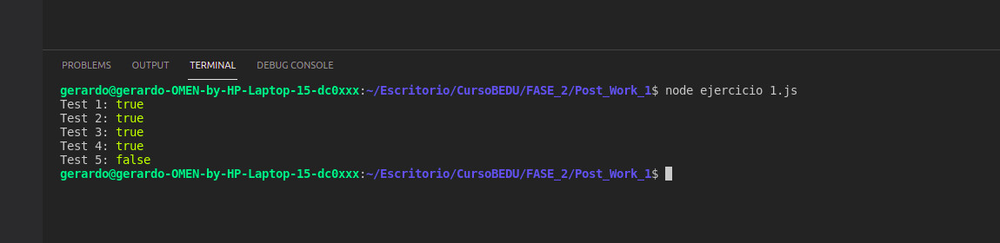

# Integrantes del equipo

- Fabian Hernandez García
- Jimena Belén Olvera Galván
- Gerardo Martínez Urbina
- Juan Daniel Alvarez Monsivais
- Ethan Becerril Holguin

# Postwork
## Ejercicio 1

[Heading link](./.ejercicio_1.js "DeepEqual:")

Escribir una función llamada deepEqual que reciba dos argumentos y retorne true si son el mismo valor o si son objetos con las mismas propiedades, en este último caso los valores de las propiedades deben ser comparados con una llamada recursiva de deepEqual.
Usando el operador typeof puedes determinar si ambas variables son objetos, de ser así se debe llamar nuevamente deepEqual para comparar las propiedades de dichos objetos, en caso contrario solo es necesario revisar si ambas variables son estrictamente iguales. 
La función Object.keys() es útil para obtener las propiedades de los objetos.

## Ejercicio 2

[Heading link](./.ejercicio_2.js "Chunk:")

Escribir una función chunk que recibe un arreglo y un número entero size. La función debe dividir el arreglo en múltiples arreglos del tamaño determinado por size.

## Ejercicio 3

[Heading link](./.ejercicio_2.js "Frequency:")

Escribir una función frequency que recibe un string como argumento. Esta función debe contar la frecuencia o el número de veces que se repite cada carácter.
El resultado debe mostrarse en un objeto donde las propiedades sean los caracteres, y los valores sean la frecuencia. Los resultados deben ordenarse de manera ascendente por los caracteres y no la frecuencia.

